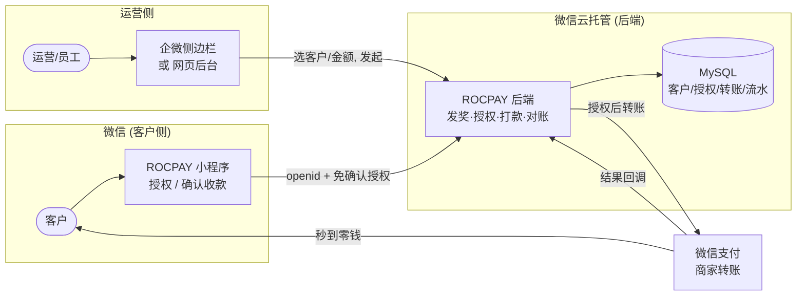
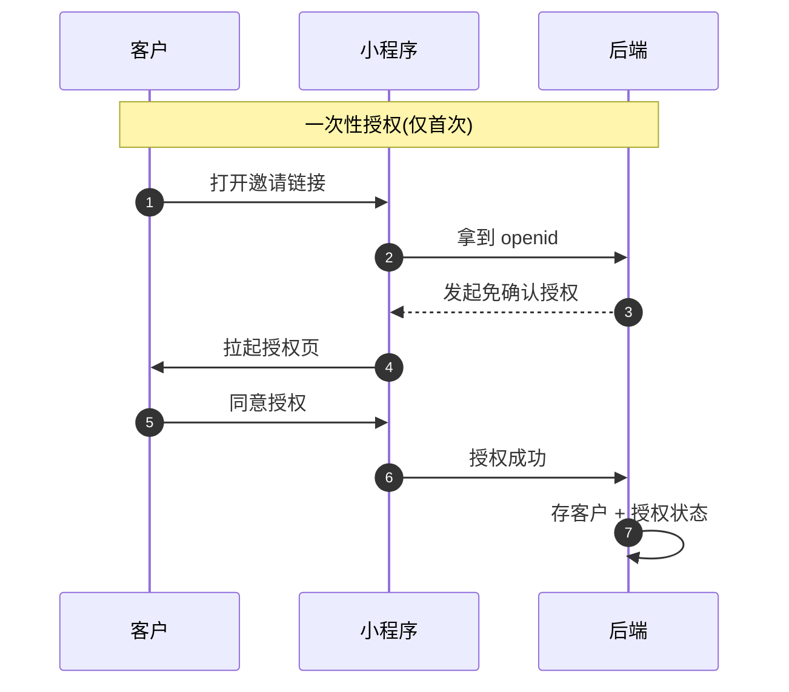
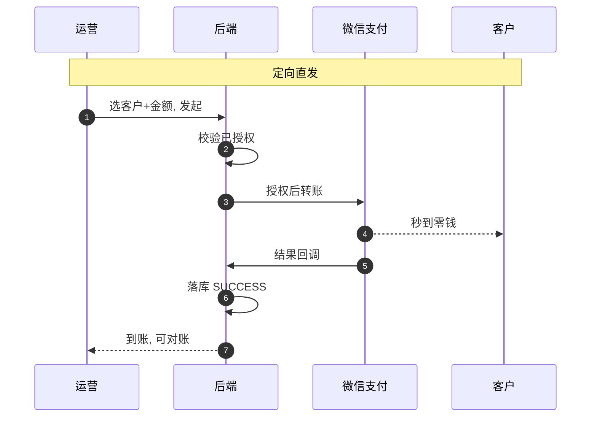

# ROCPAY 生产形态方案设计

> 从"跑通支付"到"运营直接发奖"。
> 支付轨道已打通、真金白银能到账,但现在是"自己微信生成链接→转发→谁打开谁领",绕且防不住领错。
> 本文讲清 **为什么会这样 / 生产形态该长什么样 / 分几步走到那里**,对齐后再动手。

**状态**:现状=基础链路已上线 · 目标=企微·定向·批量发放 · 决策点=先对齐架构

---

## 1. 现状 vs 目标

不是代码写差了,是产品形态还停在"验证"。逐条对照:

| 维度 | 现在(PoC) | 生产形态(目标) |
|---|---|---|
| 发起方式 | 管理员在**自己的微信小程序**里生成,再转发 | 运营在**企微/后台**选客户,一键发起 |
| 定向 | ❌ 不定向 · 谁打开链接谁领,可能领错 | ✅ 定向 · 打款到指定客户,发不错人 |
| 客户体验 | 点链接→领取→每次都要"确认收款" | 授权一次后,**直接到账、无需每次确认** |
| 批量 | ❌ 只能一笔一笔发 | ✅ 勾选一批客户,批量发放 |
| 员工管理 | ❌ 改环境变量 + 重部署 | ✅ 后台直接加/减员工 |
| 界面 | ❌ 简陋 | ✅ 专业、可对外 |

---

## 2. 根因:三条硬约束,决定了现在的别扭

这是微信支付「商家转账」的规则,**改不了**。理解它们,才知道什么能做、什么做不到。

1. **只能打到 openid**:钱只能转到微信 openid,且收款人必须在**微信小程序**里「确认收款」或先做一次授权。企微 H5 里做不了这一步。
2. **openid 事先拿不到**:你只能在用户**打开你的小程序之后**才拿到他的 openid。发之前并不知道对方 openid —— 这就是"谁打开谁领"的来源。
3. **企微身份 ≠ 微信身份**:企微"外部联系人"是 `external_userid`,**不等于**微信 openid,**不能**直接拿来打款。两套身份体系。

---

## 3. 解药:免确认收款授权

> 🔑 **关键能力**(微信官方文档「用户授权免确认模式」):客户在小程序里**授权一次**,之后你就能**直接打款到他的零钱、无需每次确认,秒到**。一次性摩擦之后,流程彻底变形态。

**它解决了什么**
- **定向**:打的是某个已授权 openid,发不错人
- **无感**:客户不用每次点确认收款
- **批量**:对已授权客户列表可批量打款

**代价 / 边界**
- 客户需**首次在小程序授权一次**(不可省)
- 需确认商户是否**已开通/可申请**该能力
- 用户可随时在微信里**撤销授权**,系统要能处理

---

## 4. 目标架构

三个角色:**客户**(在微信小程序授权/收款)、**运营**(在企微或网页后台操作)、**后端**(记账 + 调微信支付)。

*运营在企微/后台发起 → 后端对已授权客户直接打款 → 秒到,全程落库。*

---

## 5. 两条核心流程

### ① 授权流程(客户仅需一次)

### ② 定向直发(日常 · 无需客户操作)

> **对未授权客户的兜底**:运营选到**还没授权**的客户时,系统自动发一条**授权邀请**(而不是直接打款失败)。客户授权后即进入"可直发"名单。老的"确认收款"链路作为**无授权时的降级**保留。

---

## 6. 数据模型:在现有三张表上,加两张

现有 `rewards` / `transfers` / `notify_events` 保留;新增客户与授权,把"人"沉淀下来。

| 表 | 作用 | 关键字段 | 状态 |
|---|---|---|---|
| `customers` | 客户档案(搜索/筛选/批量的基础) | openid、unionid、昵称/备注、来源、标签、创建时间 | 待建 |
| `authorizations` | 免确认收款授权记录 | openid、授权单号、状态(生效/撤销)、有效期 | 待建 |
| `admins` | 员工/管理员(替代改环境变量) | openid、角色、启用、添加人 | 待建 |
| `rewards` | 每笔发放 | rid、金额、备注、发放人、状态 | ✅ 已有 |
| `transfers` | 实际转账 | out_bill_no、收款 openid、微信单号、状态 | ✅ 已有 |
| `notify_events` | 回调审计流水 | 事件类型、单号、状态、原文 | ✅ 已有 |

---

## 7. 企微集成:能做到哪、边界在哪

**✅ 能做(企微原生)**
- 做一个**企微自建应用 / 侧边栏 H5**,运营在聊天窗边操作
- 拉**客户列表**、搜索、筛选、勾选
- 发起发放、看到账状态、对账
- 通过企微给客户**发授权邀请/通知**

**⛔ 做不到(微信硬限制)**
- 客户的**授权/确认收款**不能在企微 H5 里完成 —— 只能在**微信小程序**里
- 不能拿企微 `external_userid` 直接打款 —— 要先换成小程序 openid(靠客户来授权那一步建立映射)

> ⚙️ **需要你(企微管理员)配一次**:自建应用、客户联系(External Contact)权限与 Secret、可信域名、可信 IP。到这一步我会给你一份逐项配置清单。

---

## 8. 路线图:分四期,每期都能单独上线

### 第 1 期 · 界面美化 + 后台加员工 —— 快 · 低风险
先止血:三个页面重做成专业样式,员工不用再改环境变量。
- 领取页 / 发放页 / 后台列表 全部重设计
- 超级管理员在后台**直接加/减员工**(存 `admins` 表)
- 不触碰支付架构,现有链路照常

### 第 2 期 · 客户档案 + 免确认授权 —— 核心
把"人"沉淀下来,打通授权能力。
- 接入**免确认收款授权**(申请/回调/撤销)
- 建 `customers` / `authorizations` 表,自动建客户档案
- 授权邀请页 + 授权状态管理
- ⚠️ **需你确认**:商户是否已开通/可申请「免确认收款授权」能力,及其场景要求。

### 第 3 期 · 定向直发 + 批量 —— 见效
运营选客户直接打款,天然防领错;支持批量。
- 客户列表:搜索 / 筛选 / 标签
- 单发 & **批量发放**(对已授权客户)
- 未授权自动转"发授权邀请";全程对账看板

### 第 4 期 · 企微侧边栏 / 运营后台 —— 集成
把运营端搬进企微,贴合真实工作流。
- 企微自建应用 + 侧边栏 H5
- 拉企微客户、在聊天窗边一键发放
- 与前几期的客户档案 / 授权打通
- ⚠️ **需你配**:企微自建应用、客户联系 Secret、可信域名/IP(我给清单)。

---

## 9. 开工前要确认的三件事

1. **免确认授权能力**:商户平台确认「用户授权免确认收款」是否**已开通或可申请** —— 这是第 2 期的地基。
2. **转账场景与额度**:当前 1005 佣金报酬、单笔 ¥100 / 单日 ¥1000。生产量级要**提额**,场景也要与用途一致(客户营销更贴近 1000 现金营销)。
3. **企微管理权限**:你是否有企微**管理员权限**建自建应用、开客户联系。没有的话第 4 期要先协调。

> **建议推进顺序**:先做**第 1 期**(界面+加员工,立刻不劣质),同时你去查**免确认授权能力**;确认能开 → 做 **2、3 期**(授权+定向直发,这是质变);最后按需上**第 4 期**企微集成。每期都能独立交付、独立上线。

---

*ROCPAY 生产形态方案 v1 · 待对齐 · 微信支付商家转账「用户授权免确认模式」*
