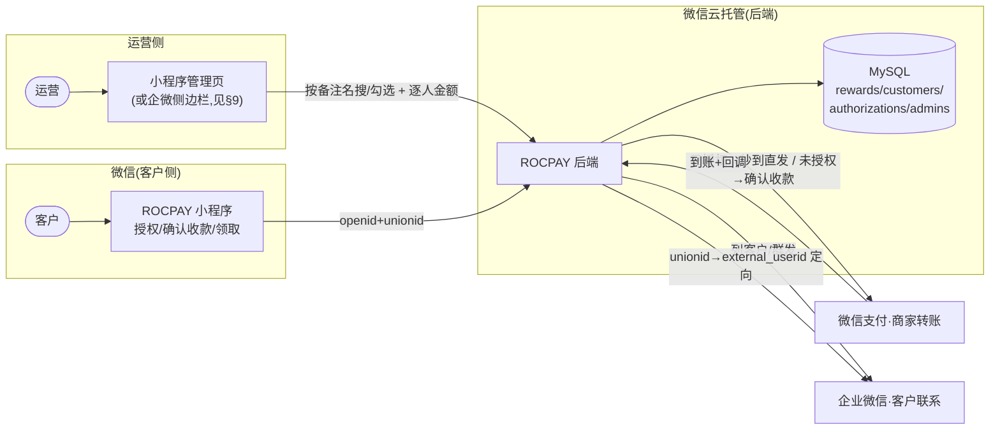
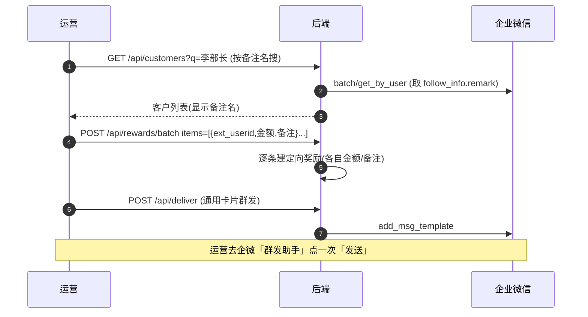
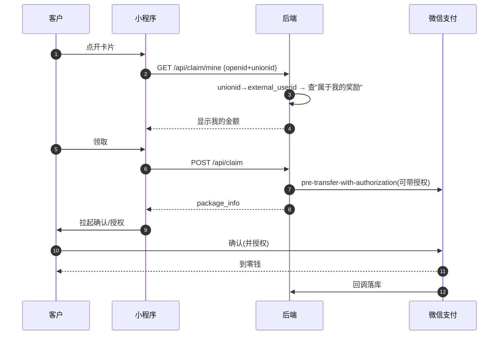

# ROCPAY 生产形态方案设计 v2.1（真实基线校准版）

> ⚠️ **历史设计文档（P2 规划期写就，保留决策脉络）。系统实际现状/接口/部署以 [`README.md`](../README.md) 与 [`DEPLOY.md`](../DEPLOY.md) 为准。**
> 其中 P2（企微定向/批量/逐人金额）**已全部落地并上线**；P3（免确认秒到授权）按下方决策记录**确定跳过**，改由"运营每次批量、客户点一下确认"覆盖。
> 此后又新增：可发额度台账、撤回资金回流、客户等级、自动对账、公网防护——这些不在本设计文档范围内，见 README「功能全景」。

> 目标形态采用外部 v2 方案（企微原生 · 定向 · 逐人金额 · 免确认秒到）。
> **但基线按真实代码校准**：当前仓库并没有 v2 所说的"已上线"企微/unionid/批量能力——那些是**净新增目标**，不是现状。

## 决策记录

- **业务模式**：大多**一次性**发放（发给不同的人、每人一次），非重复打款。
- **P3 免确认授权：跳过**。免授权只在"同一批客户反复打款"时省客户点击；一次性场景下"授权一次"≈"确认收款一次"，无收益。
- **防领错靠 P2 的 unionid 定向**（把奖励绑定到指定客户），与免授权无关。
- **P1 已完成**：界面美化 + 后台加员工（admins 表）。
- **下一步 = P2**：企微客户（按备注名选）+ unionid 定向 + 批量 + 逐人金额。

---

## 0. 现状校准（重要 · 别在错误基线上开工）

外部 v2 文档把一批**尚不存在**的功能写成了"已上线/小改"。核实当前仓库（本分支，唯一分支）后的**真实基线**：

| v2 文档称"已上线" | 当前仓库真实情况 |
|---|---|
| `unionid` 定向 | ❌ 无 |
| 企微客户列表 / `external_userid` | ❌ 无 |
| 批量 / 逐人金额 `/api/rewards/batch` | ❌ 无 |
| 企业群发 `add_msg_template` | ❌ 无 |
| `OPERATOR_MAP` 运营映射 | ❌ 无（用的是 `ADMIN_OPENIDS`） |
| 单张 `rewards` 表 | ❌ 实为 **3 张**：`rewards`/`transfers`/`notify_events` |
| 免确认授权 | ❌ 无 |

**真实 P0（已交付并真机验证）**：Express + 云托管 + MySQL(3表)；管理员(`ADMIN_OPENIDS`)生成 HMAC 令牌奖励 → 转发 → 客户领取 → **确认收款** → 到账 → 回调落库；台账 `GET /api/rewards`、单笔查询回写 `GET /api/transfers/:id`、`/api/diagnose` 自检。**定向= 无（bearer 令牌，谁打开谁领）**。

> 结论：v2 的**目标与架构正确、可采用**；但从当前基线到那个目标，企微/unionid/批量/免确认**全部是从零开始的大工程**，下面按真实工作量重排。

---

## 1. 目标形态（采用 v2 愿景）

**运营在企微里按客户备注名搜/勾选 → 每人可填不同金额/备注 → 定向发不错人 → 已授权客户秒到。**

| 维度 | 真实现状(P0) | 生产目标 |
|---|---|---|
| 发起 | 管理员在小程序生成、转发 | 运营在后台/企微选客户、批量发起 |
| 选客户 | 无客户概念 | 按**运营备注名**(`follow_info.remark`)搜索/勾选/标签 |
| 金额/备注 | 单笔一个 | **每人可不同**（逐行编辑 + 通用卡片按身份匹配） |
| 定向 | ❌ 谁打开谁领 | ✅ `unionid` 校验，只有本人能领，转发无效 |
| 客户体验 | 每次确认收款 | 授权一次后**秒到、免确认** |
| 批量 | ❌ | ✅ 勾一批、批量建定向奖励 + 群发 |
| 员工管理 | `ADMIN_OPENIDS` 环境变量 | 后台 `admins` 表增删，免重部署 |
| 台账 | ✅ 3 表可对账 | 增客户档案 + 授权 + 转账审计 |
| 界面 | 简陋 | 专业、可对外 |

---

## 2. 四条硬约束（微信规则，改不了）

1. **只能打到 openid，且首次要在微信小程序里确认/授权**。企微 H5 内做不了收款这一步。
2. **openid 事先拿不到**：只有用户打开你的小程序后才拿到。首次触达永远是"邀请客户开小程序"。
3. **企微身份 ≠ 微信身份**：`external_userid` ≠ `openid`，不能直接打款。
4. **`unionid` 身份桥（地基，当前没有，必须建）**：小程序与企微**同主体、绑同一微信开放平台**时，`unionid` 两侧一致。客户开小程序 → 拿 `openid+unionid` → 企微 `unionid_to_external_userid` 反查是哪个客户 → 把 `openid` 回填该客户档案。**没有这条桥，"按客户定向"就退化成"谁打开谁领"。** 这正是当前的状态。

---

## 3. 两个要新建的能力

### 3.1 unionid 定向（净新增）
客户开小程序 → `unionid → external_userid` → 匹配"属于他的待领奖励" → 只有本人能领；别人点开同一入口认不到，转发冒领无效。
**前提**：小程序须能拿到 `unionid`（需**微信开放平台绑定**小程序 + 企微同主体）。

### 3.2 免确认收款授权（净新增 · 秒到核心）
官方「商家转账 · 用户授权免确认模式」一整组接口：
- **发起授权**：`POST /v3/fund-app/mch-transfer/transfer-bills/pre-transfer-with-authorization` → 返回 `package_info`、`out_authorization_no`、`state`；客户在小程序里 `wx.requestMerchantTransfer` 确认收款**同时完成授权**。
- **授权后转账（秒到）**：对**已授权** openid 直接打款，无需每次确认。
- **解除授权 / 查询授权 / 授权结果回调**：完整闭环（用户也可在微信侧自行撤销）。
- **边界**：收款 openid 必须是**本商户 appid（你的小程序）下的** openid；需「商家转账」权限 + 场景；普通商户支持。可能需单独申请（返回 `NO_AUTH` 即未开通）。

> 演进关系：**首次**必是"邀请开小程序 → 确认收款（可顺带授权）"；**之后**对已授权客户"运营点一下 → 秒到"。先确认、后秒到。

---

## 4. 目标架构



---

## 5. 核心流程

### ① 运营批量定向发放（每人可不同金额）


### ② 客户首次领取（确认收款，可顺带授权）


### ③ 已授权客户 · 秒到直发（日常）
```mermaid
sequenceDiagram
  autonumber
  participant OP as 运营
  participant API as 后端
  participant WX as 微信支付
  participant C as 客户
  OP->>API: 选已授权客户+金额, 发放
  API->>API: 查 customers.openid & 授权=生效
  API->>WX: 用户授权后转账(直发)
  WX-->>C: 秒到零钱
  WX->>API: 回调; 落库 SUCCESS
```

> **兜底**：选到未开过小程序/未授权的客户 → 自动走①（建定向奖励 + 群发邀请），不报错。

---

## 6. 数据模型（在真实 3 表上增量）

现有保留：`rewards`（rid=out_bill_no、amount_fen、remark、name、status、created_by、created_at、updated_at）、`transfers`（out_bill_no、claimer_openid、transfer_bill_no、state…）、`notify_events`（审计流水）。

**待新增：**

| 表 | 作用 | 关键字段 |
|---|---|---|
| `customers` | 企微客户缓存 + 身份映射（按备注名搜索基础） | `external_userid`(PK)、`remark`(**备注名·搜索**)、`name`(昵称)、`avatar`、`mobiles`(json)、`tags`(json)、`follow_userid`、`unionid`、`openid`(开过小程序回填)、`authorized`、`updated_at` |
| `authorizations` | 免确认授权记录 | `external_userid`/`openid`、`out_authorization_no`、`state`(AUTHORIZED/REVOKED/PENDING)、`authorized_at`、`revoked_at` |
| `admins` | 员工/权限（替代 `ADMIN_OPENIDS`） | `openid`(PK)、`role`(super/operator)、`wecom_userid`、`enabled`、`created_by`、`created_at` |

> 现有 `rewards` 还需加 `target_external_userid`（定向目标）等字段，配合 unionid 定向。

---

## 7. 企微集成边界 + 两个硬需求

**能做（企微原生）**：自建应用/侧边栏 H5，列客户、**按运营备注名搜索/筛选/标签**、勾选、发放、看状态、群发通知。
**做不到（微信硬限制）**：客户**确认收款/授权只能在微信小程序**里；不能拿 `external_userid` 直接打款（靠 unionid + 小程序授权建映射）；**群发必须员工在企微点一次「发送」**（防骚扰，一批一次）。

- **硬需求①·按运营备注名搜索**：`batch/get_by_user` 的 `follow_info.remark` 是跟进员工给客户起的备注名；`external_contact.name` 才是昵称。→ 列表**以 `remark` 为主显示/搜索**，空则回退 `name`。入 `customers` 表后 SQL `LIKE` 搜索。
- **硬需求②·每人不同金额/备注**：`POST /api/rewards/batch` 设计为 `items:[{external_userid, amountYuan, remark}]` **逐条**；前端每行客户一组可编辑；通用卡片按身份匹配，每人只看到自己的金额。

---

## 8. 精确接口清单

**微信支付·商家转账**：`transfer-bills`（确认收款）· `.../out-bill-no/{no}`（查询）· `pre-transfer-with-authorization`（发起授权）· 用户授权后转账/解除/查询/回调（文档组 `4014399293`）· 前端 `wx.requestMerchantTransfer`。
**企业微信·客户联系**：`gettoken` · `externalcontact/list?userid=` · `externalcontact/batch/get_by_user`（取 `follow_info.remark`/`unionid`） · `idconvert/unionid_to_external_userid` · `externalcontact/add_msg_template`（群发） · `media/upload`（封面）。
**本系统现有**：`/api/me`、`/api/rewards`(POST/GET)、`/api/claim`、`/api/transfers/:id`、`/api/notify`、`/api/health`、`/api/diagnose`。
**待加**：`/api/customers`(+`/sync`)、`/api/rewards/batch`、`/api/deliver`、`/api/claim/mine`、`/api/admins`、`/api/authorize/*`(pre/status/revoke/notify)、`/api/pay/direct`。
> 免确认授权与部分企微接口的**确切参数/可用性，实现该期时需对最新官方文档逐一核对**（尤其免确认授权是否已开通）。

---

## 9. 路线图（按真实基线 re-based）

**P0 · 已交付（真实）**：确认收款领取全链路 + 3 表台账 + 自检。（**不含**企微/unionid/批量/免确认。）

**P1 · 界面 + 员工管理（快 · 低风险 · 无外部依赖，可立即开工）**
- 领取/发放/后台三页 UI 美化。
- `admins` 表 + 后台增删员工（替代 `ADMIN_OPENIDS`，免重部署）。
- *不碰支付架构，现有链路照常。*

**P2 · 企微客户 + unionid 定向（净新增 · 需前置条件）**
- 小程序取 `unionid`；`customers` 表 + `/api/customers/sync`（企微客户入库，按 `remark` 搜索/分页/标签）。
- unionid↔external_userid 桥；`rewards` 加定向目标；`/api/rewards/batch`（逐人金额）+ `/api/deliver`（群发）+ `/api/claim/mine`（定向领取）。
- ⚠️ **前置**：企微自建应用 + 客户联系 Secret；小程序绑微信开放平台（unionid 前提）。

**P3 · 免确认授权秒到 —— 已决定跳过**
- 原因：业务为一次性发放，免授权无收益（见"决策记录"）。若日后转向重复打款再启用。

**P4 · 企微侧边栏（可选 · 集成）**
- 运营端搬进企微自建应用/侧边栏 H5。
- ⚠️ **取舍**：侧边栏 H5 需**可信域名 = ICP 备案**。坚持免备案则运营端继续用**小程序管理页**（功能等价，少一点原生感）。

---

## 10. 开工前必须确认

1. **免确认授权可用性**（P3 地基）：商户平台确认「用户授权免确认收款/授权后转账」权限可用。
2. **微信开放平台绑定**（P2 地基）：小程序与企微**同主体**、绑**同一微信开放平台**（否则拿不到一致 unionid，定向做不了）。
3. **企微管理员权限**（P2/P4）：能建自建应用、开客户联系、拿 Secret。
4. **转账场景与额度**：现用 `1005`、单笔 ¥100/单日 ¥1000；给客户发奖更贴 `1000 现金营销`，上量前提额并保证场景合规。
5. **P4 备案取舍**：要企微侧边栏原生感 → 接受 ICP 备案；否则运营端留在小程序。

---

## 11. 关键取舍与风险

- **免备案 ↔ 企微原生侧边栏**：二选一。
- **秒到依赖"授权一次"**：首次仍要客户开小程序确认（并授权）；无法对"从没开过"的人静默直发。
- **群发需员工点发送**：企微防骚扰红线，非全自动。
- **授权可被撤销**：直发前必须查授权状态；失效自动降级回"确认收款 + 重新邀请授权"。
- **额度/风控**：提额、场景合规、单日限额、异常监控要在 P3/P4 前落实。

---

*ROCPAY v2.1 · 目标采用外部 v2，基线按真实代码校准 · 可交付开发*
